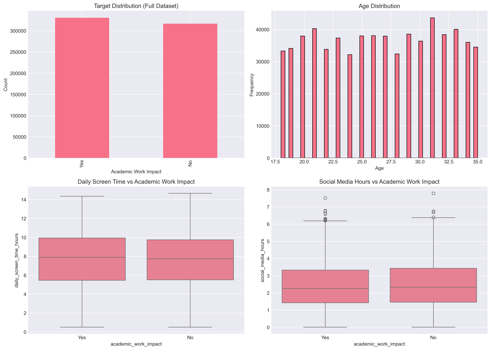
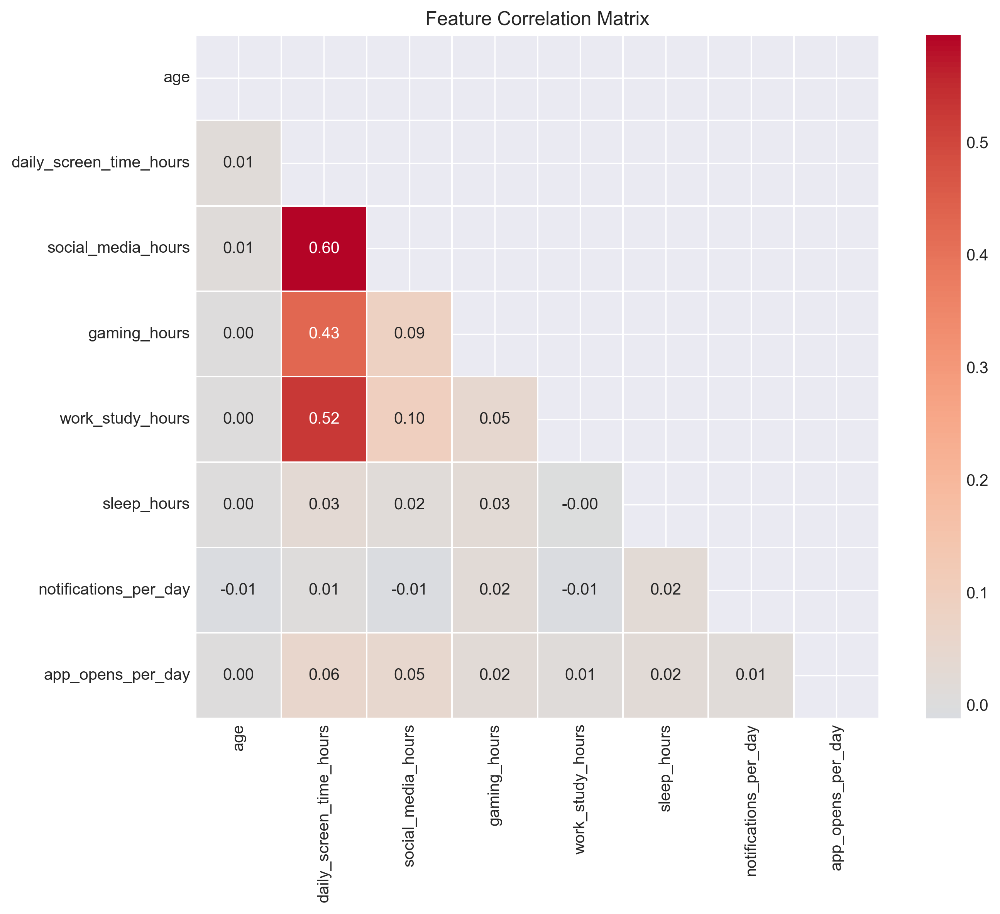

# 📱 Smartphone Addiction Prediction

> Machine learning pipeline for predicting smartphone addiction risk from behavioral and demographic data using large-scale tabular classification.

## 🎯 Project Overview

This project was developed for the **Kaggle Playground Series – Season 6, Episode 8**, a binary classification competition focused on predicting smartphone addiction risk.

The project explores **feature engineering, gradient-boosting models, ensemble methods, and hyperparameter optimization** on a dataset containing approximately **647K rows**.

### Competition Objective

* **Task:** Binary classification
* **Target:** Addiction risk
* **Evaluation Metric:** ROC-AUC
* **Best Public LB Score:** **0.5351**
* **Best Validation AUC:** **0.5357**

---

## 🏆 Results

| Model    | Validation AUC |  Public LB |
| -------- | -------------: | ---------: |
| LightGBM |     **0.5357** | **0.5351** |
| XGBoost  |         0.5348 |          — |
| CatBoost |         0.5341 |          — |
| Ensemble |         0.5351 | **0.5351** |

LightGBM produced the strongest individual validation result, while the ensemble provided a comparable public leaderboard score.

---

## 🧠 Approach

The pipeline follows a standard end-to-end tabular machine learning workflow:

```text
Raw Data
   │
   ▼
Data Cleaning
   │
   ▼
Feature Engineering
   │
   ├── Rank Features
   ├── Ratio Features
   ├── Missing-Value Indicators
   └── Interaction Features
   │
   ▼
Train / Validation
   │
   ├── LightGBM
   ├── XGBoost
   └── CatBoost
   │
   ▼
Ensemble / Model Comparison
   │
   ▼
Kaggle Submission
```

---

## 🔧 Feature Engineering

Several feature groups were evaluated to capture behavioral relationships that may not be represented directly in the original variables.

### 1. Rank Transformations

Continuous variables were transformed into percentile/rank-based representations.

This helps models capture relative behavioral patterns rather than relying only on raw numerical values.

### 2. Ratio Features

Examples include:

* Screen-time-to-sleep ratio
* Work-to-life activity ratios
* Behavioral proportion features

### 3. Missing-Value Indicators

Additional binary features identify whether an original feature contains a missing value.

```text
feature_missing = 1  → value was missing
feature_missing = 0  → value was available
```

### 4. Interaction Features

Cross-feature combinations were created to investigate relationships between behavioral and demographic variables.

---

## 🤖 Machine Learning Models

The project compares three major gradient-boosting frameworks.

### LightGBM

Used as the primary tabular classification model and achieved the strongest validation performance.

### XGBoost

Used as an independent gradient-boosting baseline and ensemble component.

### CatBoost

Included as a complementary boosting model to evaluate whether its different tree-building strategy could improve generalization.

### Ensemble

Predictions from multiple models were combined to evaluate whether model diversity could improve leaderboard performance.

---

## 🛠️ Technologies

| Category                    | Technology                  |
| --------------------------- | --------------------------- |
| Language                    | Python 3.12                 |
| ML                          | LightGBM, XGBoost, CatBoost |
| ML Framework                | Scikit-learn                |
| Data Processing             | Pandas, NumPy               |
| Hyperparameter Optimization | Optuna                      |
| Competition                 | Kaggle API                  |
| Visualization               | Matplotlib / Seaborn        |

---

## 📁 Project Structure

```text
smartphone-addiction-prediction/
│
├── README.md
├── requirements.txt
│
├── run_competition_final_optimized.py
├── run_competition_stacking_final.py
├── check_best_submissions.py
│
├── src/
│   ├── preprocessing.py
│   ├── features.py
│   └── models.py
│
├── submissions/
│   └── final_optimized_submission.csv
│
└── visualizations/
    ├── eda_plots.png
    ├── correlation_matrix.png
    ├── model_comparison_plot.png
    └── feature_importance.png
```

---

## 📊 Dataset Scale

The competition dataset contains approximately:

**647,000+ rows**

Working with a dataset of this size provided practical experience with:

* Large-scale tabular preprocessing
* Memory-efficient data manipulation
* Gradient-boosting models
* Feature engineering
* Model comparison
* Kaggle submission workflows

---

## 📈 Visualizations

The project includes several visual analyses:

### Exploratory Data Analysis



### Correlation Analysis



### Model Comparison


### Feature Importance


---

## 🚀 How to Run

### 1. Clone the Repository

```bash
git clone https://github.com/adnanphp/smartphone-addiction-prediction.git
cd smartphone-addiction-prediction
```

### 2. Install Dependencies

```bash
pip install -r requirements.txt
```

### 3. Run the Main Pipeline

```bash
python run_competition_final_optimized.py
```

### 4. Run the Stacking Experiment

```bash
python run_competition_stacking_final.py
```

### 5. Analyze Submissions

```bash
python check_best_submissions.py
```

---

## 📌 Key Learnings

### Feature Engineering Matters

Adding more features does not necessarily improve model performance. Carefully selected features performed better than simply increasing feature count.

### LightGBM Was the Strongest Individual Model

Among the tested models, LightGBM achieved the highest validation AUC.

### Ensemble Diversity

Combining different gradient-boosting models produced competitive performance, although the improvement was limited for this dataset.

### Large-Scale Tabular ML

Working with approximately 647K rows provided practical experience in handling relatively large tabular datasets within a Kaggle environment.

---

## 🔬 What This Project Demonstrates

This competition project demonstrates practical experience with:

* Binary classification
* ROC-AUC evaluation
* Large-scale tabular data
* Data preprocessing
* Feature engineering
* Gradient boosting
* LightGBM
* XGBoost
* CatBoost
* Ensemble learning
* Stacking
* Hyperparameter optimization with Optuna
* Feature importance analysis
* Kaggle API and submission workflows

---

## 📄 License

This project is licensed under the **MIT License**.

---

## ⭐ Acknowledgments

* Kaggle Playground Series
* LightGBM
* XGBoost
* CatBoost
* Scikit-learn
* Optuna

<div align="center">

**Built with Python • Machine Learning • Feature Engineering • Ensemble Models**

</div>
